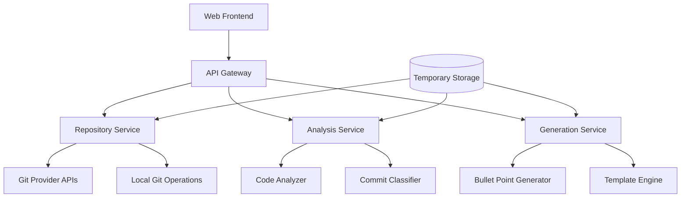

# Design Document

## Overview

The Commit Resume Generator is a web application that transforms Git commit history into professional resume bullet points. The system follows a pipeline architecture: Repository Connection → Commit Fetching → Code Analysis → Bullet Point Generation → User Review & Export. The application will be built as a single-page application with a Node.js backend, supporting multiple Git providers and offering intelligent code analysis to generate meaningful, action-oriented resume content.

## Architecture

### High-Level Architecture



### System Components

1. **Frontend Application**: React-based SPA for user interaction
2. **API Gateway**: Express.js server handling all client requests
3. **Repository Service**: Manages Git repository connections and data fetching (GitHub initially, with extensible architecture)
4. **Analysis Service**: Processes commits and code changes for insights
5. **Generation Service**: Creates and formats resume bullet points
6. **Temporary Storage**: Redis for session data and processing cache

### Implementation Approach

**Phase 1**: GitHub-only implementation with generic provider interface
**Future Phases**: Add GitLab, local Git, and other providers using the same interface

## Components and Interfaces

### Repository Service

**Purpose**: Handle Git repository connections and commit data retrieval

**Key Classes**:
- `GitProviderFactory`: Creates appropriate provider instances (initially GitHub only, extensible for future providers)
- `GitHubProvider`: Implements GitHub API integration
- `RepositoryLister`: Fetches and displays user's available repositories
- `CommitFetcher`: Orchestrates commit retrieval with filtering
- `BaseGitProvider`: Abstract base class for future provider implementations

**Interfaces**:
```typescript
interface GitProvider {
  authenticate(credentials: AuthCredentials): Promise<boolean>
  listRepositories(options?: ListOptions): Promise<Repository[]>
  fetchCommits(repositoryId: string, options: FetchOptions): Promise<Commit[]>
  validateRepository(url: string): Promise<boolean>
}

interface ListOptions {
  includePrivate: boolean
  includeOrganizations: boolean
  sortBy: 'updated' | 'created' | 'name'
}

interface Commit {
  sha: string
  message: string
  author: Author
  timestamp: Date
  filesChanged: FileChange[]
  stats: CommitStats
}
```

### Analysis Service

**Purpose**: Analyze commits and code changes to extract meaningful insights

**Key Classes**:
- `CommitAnalyzer`: Main orchestrator for commit analysis
- `CodeChangeClassifier`: Categorizes types of changes (feature, bugfix, refactor)
- `TechnologyDetector`: Identifies languages, frameworks, and tools
- `TrivialChangeFilter`: Filters out non-substantive commits
- `ImpactCalculator`: Quantifies the scope and impact of changes

**Interfaces**:
```typescript
interface AnalysisResult {
  commitId: string
  changeType: ChangeType
  technologies: Technology[]
  impact: ImpactMetrics
  significance: SignificanceLevel
}

interface ImpactMetrics {
  linesAdded: number
  linesRemoved: number
  filesModified: number
  complexity: ComplexityScore
}
```

### Generation Service

**Purpose**: Convert analysis results into professional resume bullet points

**Key Classes**:
- `BulletPointGenerator`: Main generator orchestrating the process
- `ActionVerbSelector`: Chooses appropriate action verbs based on change type
- `ImpactFormatter`: Formats impact metrics into readable text
- `TemplateEngine`: Applies templates for consistent formatting
- `ContentOptimizer`: Ensures professional language and appropriate length

**Interfaces**:
```typescript
interface BulletPoint {
  id: string
  text: string
  actionVerb: string
  impact: string
  technologies: string[]
  confidence: number
}

interface GenerationOptions {
  style: 'technical' | 'business' | 'hybrid'
  maxLength: number
  includeMetrics: boolean
}
```

## Data Models

### Core Data Models

```typescript
// User session and preferences
interface UserSession {
  id: string
  repositoryUrl: string
  authCredentials: EncryptedCredentials
  filterOptions: FilterOptions
  generationPreferences: GenerationOptions
  createdAt: Date
  expiresAt: Date
}

// Repository and commit data
interface Repository {
  id: string
  url: string
  provider: 'github' // Initially GitHub only, designed for easy extension
  name: string
  owner: string
  defaultBranch: string
  description?: string
  isPrivate: boolean
  lastUpdated: Date
}

interface FileChange {
  path: string
  changeType: 'added' | 'modified' | 'deleted' | 'renamed'
  linesAdded: number
  linesRemoved: number
  language: string
  diff: string
}

// Analysis and generation results
interface ChangeType {
  category: 'feature' | 'bugfix' | 'refactor' | 'performance' | 'documentation'
  subcategory: string
  confidence: number
}

interface Technology {
  name: string
  type: 'language' | 'framework' | 'library' | 'tool' | 'database'
  confidence: number
}
```

### Data Flow

1. **Input**: Repository URL + Authentication + Filter Criteria
2. **Processing**: Commits → Analysis Results → Bullet Points
3. **Output**: Formatted bullet points + Export options

## Error Handling

### Error Categories and Strategies

**Authentication Errors**:
- Invalid credentials: Clear error message with authentication help
- Rate limiting: Implement exponential backoff with user notification
- Token expiration: Prompt for credential refresh

**Repository Access Errors**:
- Repository not found: Validate URL format and accessibility
- Permission denied: Guide user through access token setup
- Network issues: Retry with timeout and fallback options

**Analysis Errors**:
- Unsupported file types: Skip with warning, continue processing
- Large repository handling: Implement pagination and progress tracking
- Parsing failures: Log error, continue with remaining commits

**Generation Errors**:
- Insufficient data: Provide guidance on improving commit quality
- Template failures: Fallback to basic formatting
- Export issues: Offer alternative export formats

### Error Recovery Mechanisms

```typescript
interface ErrorHandler {
  handleRepositoryError(error: RepositoryError): Promise<ErrorResponse>
  handleAnalysisError(error: AnalysisError): Promise<void>
  handleGenerationError(error: GenerationError): Promise<BulletPoint[]>
}

interface ErrorResponse {
  message: string
  suggestedActions: string[]
  retryable: boolean
}
```

## Testing Strategy

### Unit Testing
- **Repository Service**: Mock Git provider APIs, test authentication flows
- **Analysis Service**: Test with sample commits and known code patterns
- **Generation Service**: Verify bullet point quality and formatting
- **Error Handling**: Test all error scenarios and recovery mechanisms

### Integration Testing
- **End-to-end workflows**: Repository connection → analysis → generation
- **Provider integration**: Test with real GitHub/GitLab repositories
- **Performance testing**: Large repository handling and response times

### Test Data Strategy
- **Sample repositories**: Create test repos with various commit patterns
- **Mock data**: Realistic commit data for consistent testing
- **Edge cases**: Empty repos, single commits, massive repositories

### Quality Metrics
- **Bullet point quality**: Manual review of generated content
- **Accuracy testing**: Compare generated points with manual analysis
- **Performance benchmarks**: Response times for different repository sizes
- **Security testing**: Credential handling and data protection

## Security Considerations

### Data Protection
- **Credential encryption**: AES-256 encryption for stored tokens
- **Session management**: Secure session tokens with expiration
- **Code content**: No permanent storage of repository code
- **Audit logging**: Track access and processing activities

### Access Control
- **Authentication**: Support for multiple auth methods (tokens, OAuth)
- **Authorization**: Respect repository permissions and access levels
- **Rate limiting**: Prevent abuse of Git provider APIs
- **Input validation**: Sanitize all user inputs and repository URLs